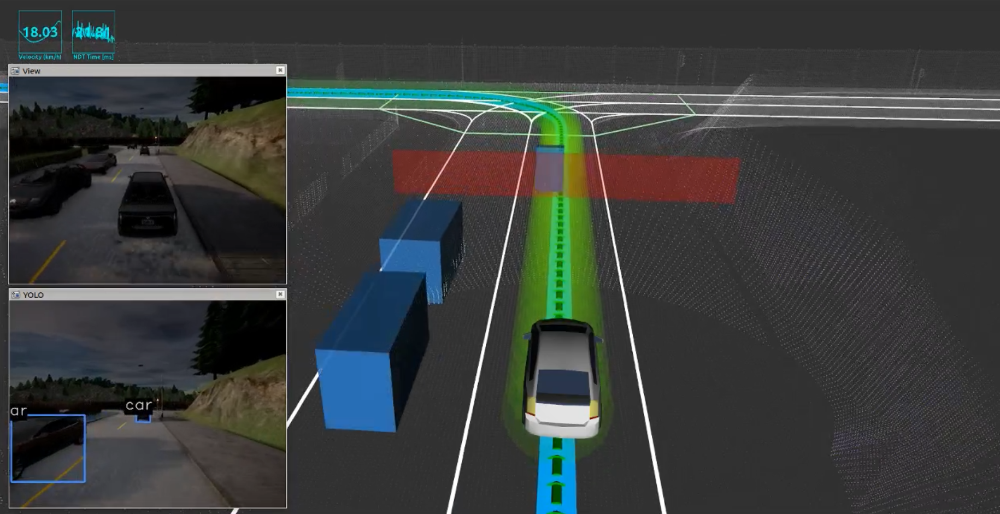

# Autoware in CARLA

The carla autoware bridge is now hosted and maintained [here](https://github.com/Autoware-AI/simulation/tree/master/carla_simulator_bridge).

This repository contains a demonstrator of an autoware agent ready to be executed with CARLA.

**The carla autoware integration requires CARLA 0.9.10**

## CARLA autoware agent
The autoware agent is provided as a ROS package. All the configuration can be found inside the `carla-autoware-agent` folder.



The easiest way to run the agent is by building and running the provided docker image.

### Requirements

- Docker (19.03+)
- Nvidia docker (https://github.com/NVIDIA/nvidia-docker)

### Setup

Firstly clone the carla autoware repository, where additional [autoware contents](https://bitbucket.org/carla-simulator/autoware-contents.git) are included as a submodule:

```sh
git clone --recurse-submodules https://github.com/carla-simulator/carla-autoware
```

Afterwards, build the image with the following command:

```sh
./build.sh
```

This will generate a `carla-autoware:latest` docker image.

### Run the agent

1. Run a CARLA server.

You can either run the CARLA server in your host machine or within a container. To start a CARLA server within a docker container first pull the CARLA image for 0.9.10:

```sh
docker pull carlasim/carla:0.9.10
```

Then, run the following command:

```sh
docker run -p 2000-2002:2000-2002 --runtime=nvidia --gpus all carlasim/carla:0.9.10
```

You may find more information about running CARLA using docker [here](https://carla.readthedocs.io/en/latest/build_docker/)

2. Run the `carla-autoware` image: 

```sh
./run.sh
```

This will start an interactive shell inside the container. To start the agent run the following command:

```sh
roslaunch carla_autoware_agent carla_autoware_agent.launch town:=Town01
```

## CARLA Autoware contents
The [autoware-contents](https://bitbucket.org/carla-simulator/autoware-contents.git) repository contains additional data required to run Autoware with CARLA, including the point cloud maps, vector maps and configuration files.

